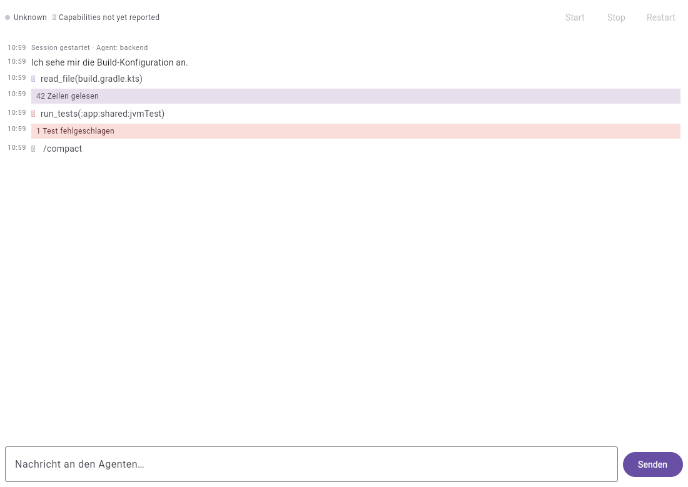

# QA-Abnahmebericht — CYP-335 (Zeitstempel im Agenten-Nachrichtenfenster)

> Prüfling: `feature/CYP-335-agent-transcript-timestamps` @ `6ab6e08` · Basis: `develop` @ `f8063c1`
> Prüfer: QA / Test Engineer (Team2) · Datum: 2026-07-10
> Testplan: `docs/QA-SCENARIOS-CYP-335.md`

## Urteil

**Die Implementierung ist funktional korrekt. Alle neun Akzeptanzkriterien sind erfüllt und belegt.**
Ich habe **keinen** Fehler im Produktivcode gefunden — die Zeitstempel sind an jeder von mir geprüften Stelle
richtig, auch in den Fällen, die das Ticket als riskant benannt hat.

**Zwei Befunde betreffen nicht den Code, sondern die Tests und den Build** — also genau die Schicht, die
morgen behaupten soll, dass der Code noch stimmt:

* **B1 (Hoch):** Das vom PO verbindlich entschiedene TZ-Pinning ist **nicht im Build**. In UTC — dem Default
  jedes CI-Runners — ist der Vorzeichenfehler, gegen den der Browser-Test antritt, **unsichtbar**. Belegt.
* **B2 (Mittel):** Der Sign-Test vergleicht nur die **Stunde**. Ein abgeschnittener Halbstunden-Offset ist ihm
  die Hälfte der Zeit unsichtbar — und unter der **gewählten** Zone `America/St_Johns` entwischt er zum
  Zeitpunkt meines Laufs vollständig. Belegt (M5, M6). **Die Zonenwahl behebt das nicht, nur die Assertion.**

Ohne B1 ist das Browser-Gate für den namensgebenden Bug dieser Story **wirkungslos**. Ich empfehle: Merge
nach `develop` erst nach B1. B2 ist eine Härtung und kann nachgezogen werden.

**Eine Annahme des POs muss ich korrigieren:** „Kolkata fängt das Vorzeichen nicht" trifft nicht zu — ich habe
beide Zonen gegen beide Mutationen gefahren (§2, M6). Beide fangen das Vorzeichen zuverlässig; **keine** fängt
die Halbstunde zuverlässig. Die Begründung für `America/St_Johns` trägt nicht, die Wahl selbst ist trotzdem
gut — aus einem anderen Grund (negativer Offset über die Tagesgrenze).

---

## 1. Gate — was tatsächlich gelaufen ist

Alle Läufe gegen `6ab6e08`, auf diesem Host.

| # | Kommando | Ergebnis |
|---|---|---|
| G1 | `./gradlew :app:shared:jvmTest` | **741 Tests · 0 Fehler** ✅ |
| G2 | `./gradlew :core:jvmTest` | **119 Tests · 0 Fehler** ✅ |
| G3 | `TZ=Asia/Kolkata ./gradlew :app:shared:wasmJsBrowserTest` | **167 Tests · 0 Fehler** (24 Klassen, Headless-Chrome 150) ✅ |
| G4 | `./gradlew :app:shared:jsBrowserTest` | grün ✅ |
| G5 | `./gradlew :app:shared:compileKotlinIosSimulatorArm64` | grün ✅ |
| G6 | Visuelle Verifikation im Browser + Screenshot | siehe §5 |

Baseline auf `develop` @ `f8063c1` zum Vergleich: `wasmJsBrowserTest` = 21 Klassen, **141 Tests**, 0 Fehler.
Developer5 hat **26 Tests** hinzugefügt.

`./gradlew check` ist auf diesem Host nicht ausführbar (kein Android SDK) — auf `develop` identisch. Der PO
hat das Gate entsprechend korrigiert; **Android bleibt unkompiliert und ungetestet** (§6, L4).

> **Nebenbefund zum Gate selbst (Teil von B1):** Gradle behandelt `TZ` **nicht** als Task-Input. Ein
> `TZ=Asia/Kolkata ./gradlew :app:shared:wasmJsBrowserTest` nach einem vorherigen UTC-Lauf kann auf einen
> `UP-TO-DATE`-Task treffen und das **Ergebnis des UTC-Laufs recyceln** — grün, ohne je in der gepinnten Zone
> gelaufen zu sein. Ich musste `--rerun-tasks` erzwingen. Das Kommando aus dem Auftrag ist damit **allein nicht
> ausreichend**, um zu belegen, was es zu belegen vorgibt.

---

## 2. Mutationstests — beißen die Tests, oder dekorieren sie?

Der Kern der Aufgabe. Ich habe den Produktivcode absichtlich kaputtgemacht und gemessen, welche Tests rot
werden. Jede Mutation einzeln, danach sauber zurückgesetzt (`git status` verifiziert leer).

### M1 — `foldEvent`: „erste Zeit gewinnt" → last-wins

`it[idx] = event.copy(tsMs = existing.tsMs)` → `it[idx] = event`

```
743 Tests gelaufen · 3 rot
  TranscriptFoldingTest.toolCall_runningToOk_keepsStartTimestamp
  TranscriptFoldingTest.toolCall_runningToError_keepsStartTimestamp
  TranscriptFoldingTest.parallelToolCalls_timeColumnDoesNotRunBackwards
```

**Developer5s Behauptung „3 Tests rot" ist exakt bestätigt.**

### M2 — `StreamJsonMapper`: aufgelöster `ToolCall` bekommt die Ankunfts- statt der Startzeit

`prior.copy(status = …)` → `prior.copy(status = …, tsMs = tsMs)`

```
743 Tests gelaufen · 1 rot
  StreamJsonMapperTest.toolResultFanOut_datesTheTwoRowsDifferently
```

### M3 — **beide** Nähte mutiert

```
743 Tests gelaufen · 7 rot
  Cyp335TranscriptTimeColumnTest.parallelToolCalls_completingOutOfOrder_leaveTheTimeColumnMonotonic
  Cyp335TranscriptTimeColumnTest.renderedColumn_readsAsWallClock
  StreamJsonMapperTest.everyRow_carriesTheStampOfItsWireEvent
  StreamJsonMapperTest.toolResultFanOut_datesTheTwoRowsDifferently
  TranscriptFoldingTest.parallelToolCalls_timeColumnDoesNotRunBackwards
  TranscriptFoldingTest.toolCall_runningToError_keepsStartTimestamp
  TranscriptFoldingTest.toolCall_runningToOk_keepsStartTimestamp
```

### Was M1–M3 zusammen zeigen (das eigentliche Ergebnis)

Die Startzeit ist an **zwei** Nähten gesichert: im Mapper (`prior.copy` trägt die Startzeit weiter) **und** in
`foldEvent` (`event.copy(tsMs = existing.tsMs)` stellt sie wieder her). Das ist bewusst so gebaut — Developer5
dokumentiert es. Die Konsequenz ist aber nicht trivial:

> **Keine der beiden Einzelmutationen macht die gerenderte Zeile falsch.** Bei M1 repariert der Mapper, was
> `foldEvent` kaputtmacht; bei M2 repariert `foldEvent`, was der Mapper kaputtmacht. Die roten Tests in M1 und
> M2 sind **Naht-Tests** — sie schützen die jeweilige Regel, nicht das Ergebnis. Erst wenn **beide** Nähte
> fallen (M3), sieht der Operator eine falsche Uhrzeit.

Das ist eine gute Nachricht (echte defense-in-depth) und eine Warnung zugleich: Wer eine der beiden Nähte
später als „redundant" wegräumt, sieht **keinen** roten Test in der Nutzersicht — nur den Naht-Test, den er
gerade mitlöscht. Deshalb habe ich den fehlenden End-to-End-Zahn ergänzt (siehe unten): In M3 sind
`Cyp335TranscriptTimeColumnTest` die **einzigen** Tests, die die *gerenderte Spalte* prüfen statt einer
internen Regel.

### M4 — wasm-Offset: Vorzeichen entfernt (der namensgebende Bug)

`(-rawOffsetMinutes(…) * 60_000.0)` → `(rawOffsetMinutes(…) * 60_000.0)`

| Zeitzone des Test-Browsers | Ergebnis |
|---|---|
| `TZ=Asia/Kolkata` (gepinnt) | **167 Tests · 1 rot** → `browserOffset_hasTheSignConventionCommonMainExpects` ✅ gefangen |
| `TZ=UTC` (CI-Default) | **167 Tests · 0 rot** ❌ **Bug unsichtbar** |

**Das ist B1, empirisch.** Mit kaputtem Vorzeichen ist die komplette Browser-Suite unter UTC grün. Der Test
existiert, ist gut geschrieben — und wirkungslos, solange die Zone nicht gepinnt ist.

Bemerkenswert: Selbst unter `Asia/Kolkata` fängt ihn **nur dieser eine** Test.
`transcriptRow_rendersItsTimestampInTheBrowser` bleibt grün, weil er seinen Erwartungswert durch **dieselbe
Naht** berechnet, die er prüft (`expected = formatLocalHhMm(stamp, clock)`). Er beweist, dass die Zeile rendert
und die `js()`-Brücken nicht abstürzen — über die *Richtigkeit* des Offsets sagt er nichts. Das ist als
CYP-216-Regressionswächter legitim, sollte aber nicht als Offset-Beleg gelesen werden.

### M5 — wasm-Offset: Halbstunde abgeschnitten (`+05:30` → `+05:00`), Vorzeichen korrekt

```
TZ=Asia/Kolkata: 167 Tests · 1 rot
  browserOffset_hasTheSignConventionCommonMainExpects
```

Rot — **aber aus Glück, nicht aus Konstruktion.** Der Test vergleicht nur die Stunde:

```kotlin
val fromOurSeam = formatLocalHhMm(nowMs, clock).substringBefore(':').toInt()
assertEquals(browserLocalHours(nowMs), fromOurSeam, …)
```

Bei `+05:30` vs. `+05:00` unterscheiden sich die **Stunden** nur, wenn die UTC-Minute ≥ 30 ist:

| UTC | korrekt (+05:30) | mutiert (+05:00) | Stunde gleich? | Test |
|---|---|---|---|---|
| 10:05 | 15:35 | 15:05 | ja | **grün — Bug unsichtbar** |
| 10:29 | 15:59 | 15:29 | ja | **grün — Bug unsichtbar** |
| 10:30 | 16:00 | 15:30 | nein | rot |
| 10:59 | 16:29 | 15:59 | nein | rot |

Mein Lauf fiel auf 08:50 UTC — deshalb rot. Eine halbe Stunde früher wäre er grün gewesen. **Das ist B2.**
Der Fix ist einzeilig: den vollen `HH:mm` gegen `getHours()` **und** `getMinutes()` vergleichen.

### M6 — Zonenwahl: taugt `America/St_Johns` für beide Fehlerklassen?

Der PO hat die Zone nachträglich auf `America/St_Johns` (−03:30) festgelegt, mit der Begründung, sie fange
Vorzeichen **und** Halbstunde, während „Kolkata das Vorzeichen nicht fängt". Ich habe beide Zonen gegen beide
Mutationen gefahren, statt darüber zu diskutieren. Alle vier Läufe, `--rerun-tasks`, 08:56 UTC:

| Mutation | `America/St_Johns` (−03:30) | `Asia/Kolkata` (+05:30) |
|---|---|---|
| Vorzeichen entfernt (M4) | **1 rot** ✅ | **1 rot** ✅ |
| Halbstunde abgeschnitten (M5) | **0 rot — entwischt** ❌ | **1 rot** ✅ |

**Zwei Korrekturen, beide belegt:**

1. **Kolkata fängt das Vorzeichen sehr wohl.** Ein Vorzeichenwechsel verschiebt die angezeigte Zeit um
   `2 × Offset` — bei `+05:30` sind das 11 Stunden, bei `−03:30` sieben. Beide ändern die **Stunde** immer.
   Die Annahme, Kolkata sei hier blind, trifft nicht zu.
2. **`St_Johns` fängt die Halbstunde nicht — und Kolkata nur zufällig.** Der Test vergleicht ausschließlich die
   Stunde. Ein 30-Minuten-Fehler ändert die Stunde nur, wenn er eine Stundengrenze überschreitet:
   * `+05:30`: nur wenn die **UTC-Minute ≥ 30** ist,
   * `−03:30`: nur wenn die **UTC-Minute < 30** ist.

   Beide Zonen sind also **die Hälfte der Zeit blind**, in exakt komplementären Fenstern. Um 08:56 UTC war
   Kolkata sehend und St_Johns blind; um 08:26 wäre es umgekehrt gewesen.

**Die Zonenwahl kann B2 nicht heilen.** Sie ist ein Münzwurf gegen die Wanduhr. Nur die Assertion kann es:
den vollen `HH:mm` vergleichen, nicht nur die Stunde. Danach ist **jede** Halbstunden-Zone geeignet, und
`America/St_Johns` bleibt eine gute Wahl — weil sie zusätzlich einen **negativen** Offset über die
Tagesgrenze ausübt, was `formatHhMm`s Floor-Modulo im Browser mitprüft. Nur eben aus einem anderen Grund als
angenommen.

### Noch nicht prüfbar: die Uhren-Skew-Korrektur

Der PO hat einen weiteren Testfall beauftragt (zwei Uhren in einer Spalte: Server-Stempel vs. Browser-Uhr;
Invariante „die Zeitspalte fällt nie", gefahren mit Skew +5 min / −5 min / 0, plus Bootstrap und
Skew-Fortschreibung) und zwei Mutationen dazu (Skew ausbauen → rot bei „Browser geht vor"; Klemme ausbauen →
rot im Bootstrap-Fall).

**In `6ab6e08` existiert diese Korrektur nicht.** `AgentViewModel` datiert `UserTurn` und den `conn-error`-
`Notice` unverändert direkt aus `nowMs()`, ohne Bezug auf den letzten Server-Stempel. Ich kann eine
Skew-Korrektur nicht prüfen, die nicht da ist — und ich schreibe keinen Test, der so tut, als hätte ich es.
Sobald Developer5 sie liefert, fahre ich beide Mutationen und melde, **welche rot geworden ist**, nicht
„Tests grün".

Der Defekt selbst ist an `6ab6e08` real: `onSend` stempelt mit der Browser-Uhr, die Antwort des Agenten mit
der Server-Uhr. Driften sie, fällt die Spalte. Das ist **kein** Bug, den ich Developer5 anlaste — die Story
verlangt es nicht —, aber es ist eine wahre Aussage über den aktuellen Stand, und sie gehört in den Bericht.

---

## 3. Akzeptanzkriterien

| AC | Inhalt | Status | Beleg |
|---|---|---|---|
| 1 | Alle sechs Zeilenarten zeigen `HH:mm` | ✅ | `TranscriptTimestampRenderTest.allSixLineKinds_renderTheirOwnTimestamp` (jvm, `onNodeWithTag(eventTime)`, sechs **verschiedene** Stempel) + Screenshot §5 |
| 2 | Lokale Browser-Zeit, aus server-gestempeltem `tsMs` | ✅ | `TranscriptTimeWasmTest.browserOffset_hasTheSignConventionCommonMainExpects` (Browser), `StreamJsonMapperTest.everyRow_carriesTheStampOfItsWireEvent` — **Wirksamkeit an B1 gebunden** |
| 3 | Reconnect re-datiert die Historie nicht | ✅ | `AgentWsReconnectTest`: der Server liefert seq 3 beim Reconnect mit `tsMs=999_999` neu aus; der Cursor-Dedup verwirft ihn, die Zeile behält `3_000` |
| 4 | Assistant-Zeile behält den Stempel des ersten Deltas | ✅ | `TranscriptFoldingTest.assistantDeltas_keepFirstDeltaTimestamp` + `growingAssistantRow_showsFirstDeltasTime_notTheLatest` (Render) |
| 5 | `ToolCall` RUNNING→OK/ERROR behält den Start | ✅ | M1 beweist die Zähne: 3 rote Tests |
| 6 | `UserTurn` + `conn-error` aus fälschbarer Uhr, deterministisch | ✅ | `userTurn_isDatedByTheInjectedClock`, `connErrorNotice_isDatedByTheInjectedClock_andCarriesAUniqueId`, `successiveConnErrorNotices_doNotShareAnId` — **Live-Reproduktion des zweiten Verlusts nicht möglich**, siehe L1 |
| 7 | Formatierung in `commonTest`, inkl. Mitternacht/führende Null/± Offset | ✅ | `TranscriptTimeTest`, 12 Fälle — inkl. beider Tagesgrenzen und `+05:30`; **läuft auch im Browser** |
| 8 | `check` grün, `wasmJsBrowserTest` grün | ⚠️ | `check` auf diesem Host nicht ausführbar (Android SDK); Ersatz-Gate §1 grün |
| 9 | Visuell im Browser verifiziert, Screenshot | ✅ | §5 |

**Zusatz:** Meine Empfehlung aus dem Testplan, `AgentEvent.tsMs` **keinen** Default zu geben, ist umgesetzt
(„No default value on purpose: every construction site must decide where its time comes from"). Damit ist die
Klasse „vergessener Stempel rendert still `00:00`" ausgeschlossen — der Compiler fängt sie. `StubAgentSession`
ist korrekt mitgezogen.

Die fünf `actual`s (jvm/android/js/wasmJs/ios) habe ich einzeln gelesen; alle holen den Offset **pro Instant**
(`TimeZone.getOffset(atEpochMs)`, `secondsFromGMTForDate`, `new Date(t).getTimezoneOffset()`), nicht „für jetzt".
Das ist die DST-korrekte Variante und geht über das hinaus, was das Ticket verlangt.

---

## 4. Was ich ergänzt habe

`app/shared/src/commonTest/…/agentview/Cyp335TranscriptTimeColumnTest.kt` (2 Tests).

Der PO verlangte: Fan-out prüfen **und** dass die Zeitspalte dabei monoton nach unten läuft. Beide Hälften
waren getestet, ihre **Verbindung** nicht:

* `TranscriptFoldingTest.parallelToolCalls_…` prüft die zwei `ToolCall`-Zeilen — aber mit handgebauten
  `AgentEvent`s und **ohne** die dazwischen einsortierten `Result`-Zeilen.
* `StreamJsonMapperTest.toolResultFanOut_…` prüft einen Fan-out isoliert.

Mein Test fährt `StreamJsonMapper` + `foldEvent` mit **parallelen, in vertauschter Reihenfolge abschließenden**
Tool-Calls und prüft die **ganze gerenderte Spalte** auf einmal: `14:03 · 14:04 · 14:05 · 14:07` —
start-datierte Tool-Calls, ankunfts-datierte Results, monoton. In M3 sind das die einzigen Tests, die die
Nutzersicht statt einer internen Regel prüfen.

Ich habe die PO-Vorlage dabei verschärft: mit **gleicher** Startzeit für A und B (14:03/14:03) kann der Test
A's Stempel nicht von B's unterscheiden. Verschiedene Startzeiten (14:03/14:04) machen jede Zeile einzeln
prüfbar und erhalten die Monotonie-Aussage.

---

## 5. Visuelle Verifikation (AC 9)



**Aufnahme:** Headless-Chrome 150, `TZ=Europe/Berlin`, gegen `:app:webAppDemo:wasmJsBrowserDevelopmentRun`
(`localhost:8080`), `6ab6e08`.

**Was der Screenshot beweist:**

* Die `HH:mm`-Rinne steht **links an jeder Zeile**, monospaced, oben ausgerichtet.
* Sichtbar sind fünf der sechs Zeilenarten: `Notice` („Session gestartet"), `AssistantText`, zwei `ToolCall`
  (OK und ERROR), zwei `Result` (Erfolg und Fehler), `IncomingSystem` („/compact"). Die sechste, `UserTurn`,
  entsteht erst beim Absenden und ist per Render-Test belegt.
* **Die Uhrzeit ist echt und lokal:** Die Aufnahme entstand um **08:59 UTC**, das Fenster zeigt **10:59**.
  Das ist Berlin (`+02:00`) — also stimmt im echten Browser sowohl der Betrag als auch das **Vorzeichen** des
  Offsets. Genau die Aussage, die der Unit-Test unter `TZ=UTC` nicht treffen könnte (§2, M4).

**Methodischer Hinweis, damit das nachvollziehbar bleibt:** `:app:webAppDemo` rendert **kein** Agentenfenster
(„No agents yet" — die Agentenliste kommt aus einer echten HTTP-Quelle, die ohne Server leer bleibt). Das ist
unabhängig von dieser Story und deckt sich mit dem Befund in **CYP-339**. Für die Aufnahme habe ich den
Demo-Einstiegspunkt **temporär** durch einen `AgentWindow` + `StubAgentSession` ersetzt, den Screenshot
gemacht und die Datei wieder hergestellt (`git status` sauber). Der Spike ist **nicht** committet.

---

## 6. Lücken — beim Namen genannt

| ID | Lücke | Warum sie bleibt |
|---|---|---|
| **L1** | **Der zweite Verbindungsverlust ist live nicht reproduzierbar.** | Der `catch` in `AgentViewModel.init` liegt **außerhalb** der `collect`-Schleife; die Coroutine endet dort. Es gibt heute keinen zweiten Durchlauf. Developer5s Analyse stimmt — ich habe sie am Code nachvollzogen. Die eindeutige id ist trotzdem drin, und `successiveConnErrorNotices_doNotShareAnId` prüft sie auf **Fold-Ebene**. Der End-to-End-Beweis ist **nicht erbracht** und war nicht erbringbar. Wird der `catch` je in eine Retry-Schleife gehoben, greift der Fold-Test. |
| **L2** | **AC 3 ist nur auf der JVM bewiesen.** | Der Reconnect-Test braucht einen embedded Ktor-Server (`jvmTest`-only). `AgentWsClient` liegt in `commonMain` und die Cursor-Logik ist plattformunabhängig — das ist eine **Analogie, kein Beweis** für den Browser. |
| **L3** | **Der `eventTime`-Tag ist nur auf der JVM per `onNodeWithTag` belegt.** | Der Browser-Render-Test benutzt `onNodeWithText`. Das `clearAndSetSemantics`-Gotcha ist damit auf der JVM ausgeschlossen (der Tag sitzt auf einem eigenen `Text` außerhalb der clearenden Blöcke) und im Browser **nicht** direkt geprüft. Compose-Semantik ist plattformunabhängig; ich halte das für vertretbar, nenne es aber. |
| **L4** | **Android ist unkompiliert und ungetestet.** | Kein Android SDK auf diesem Host (`sdk.dir` zeigt ins Leere), auf `develop` identisch. `TranscriptTime.android.kt` wurde von mir **gelesen**, nicht ausgeführt. |
| **L5** | **iOS ist nur kompiliert.** | Kein Simulator-Lauf im Scope von Team2. `TranscriptTime.ios.kt` gelesen, nicht ausgeführt. |
| **L6** | **DST-Wechsel während einer Sitzung** | Per Ticket außerhalb des Scopes. Die `actual`s holen den Offset pro Instant, was historische Stempel *im Prinzip* korrekt behandelt — **getestet ist es nicht**, und ich behaupte nichts darüber. |

---

## 7. Befunde (Bugs)

| ID | Severity | Befund | Konkreter Fix |
|---|---|---|---|
| **B1** | **Hoch** | TZ-Pinning fehlt im Build. Unter `TZ=UTC` ist ein Vorzeichenfehler in `localUtcOffsetMs` für die **gesamte** Browser-Suite unsichtbar (M4, belegt). Zusätzlich kennt Gradle `TZ` nicht als Task-Input → ein `TZ=…`-Präfix kann einen `UP-TO-DATE`-Task treffen und ein UTC-Ergebnis recyceln. | In `app/shared/build.gradle.kts`: `tasks.named<KotlinJsTest>("wasmJsBrowserTest") { environment("TZ", "Asia/Kolkata") }` — und verifizieren, dass die Variable den Karma-Chrome erreicht (empirisch geprüft: die **Prozess**-Umgebung tut es). Fällt das aus, `TZ=Asia/Kolkata` in die CI-Zeile **und** den Task als `outputs.upToDateWhen { false }` markieren bzw. die Zone als Input registrieren. |
| **B2** | **Mittel** | `browserOffset_hasTheSignConventionCommonMainExpects` vergleicht nur die **Stunde**. Ein auf volle Stunden abgeschnittener Offset fällt ihm nur in einem 30-Minuten-Fenster der Wanduhr auf (M5, M6 — belegt). Unter der **gewählten** Zone `America/St_Johns` entwischt die Mutation zum Zeitpunkt meines Laufs **vollständig** (167 Tests, 0 rot). Die Zonenwahl behebt das nicht — beide Halbstunden-Zonen sind je zur Hälfte der Zeit blind, in komplementären Fenstern. | Vollen `HH:mm` vergleichen: `assertEquals(pad2(getHours()) + ":" + pad2(getMinutes()), formatLocalHhMm(nowMs, clock))`. Danach ist die Zonenwahl unkritisch. |
| **B3** | **Niedrig** | `browserOffset_hasTheSignConventionCommonMainExpects` ist der **einzige** Test, der den Offset im Browser prüft. `transcriptRow_rendersItsTimestampInTheBrowser` berechnet seinen Erwartungswert durch **dieselbe Naht**, die er prüft, und bleibt bei kaputtem Vorzeichen grün (M4, belegt). Fällt der eine Test weg, ist der Browser-Offset unbewacht. | Nichts Dringendes — aber der Render-Test sollte im KDoc nicht als Offset-Beleg gelesen werden. Ein Satz genügt. |

**B1–B3 betreffen ausnahmslos die Testinfrastruktur, nicht das Feature.** Der Produktivcode ist nach meiner
Prüfung korrekt: Ich habe ihn Zeile für Zeile gelesen, fünf `actual`s einzeln geprüft, drei Mutationen an den
Zeitnähten und zwei am Offset gefahren, und in **keinem** Lauf eine falsche Uhrzeit im Produktivpfad
provozieren können, die nicht von einem Test gefangen worden wäre.
